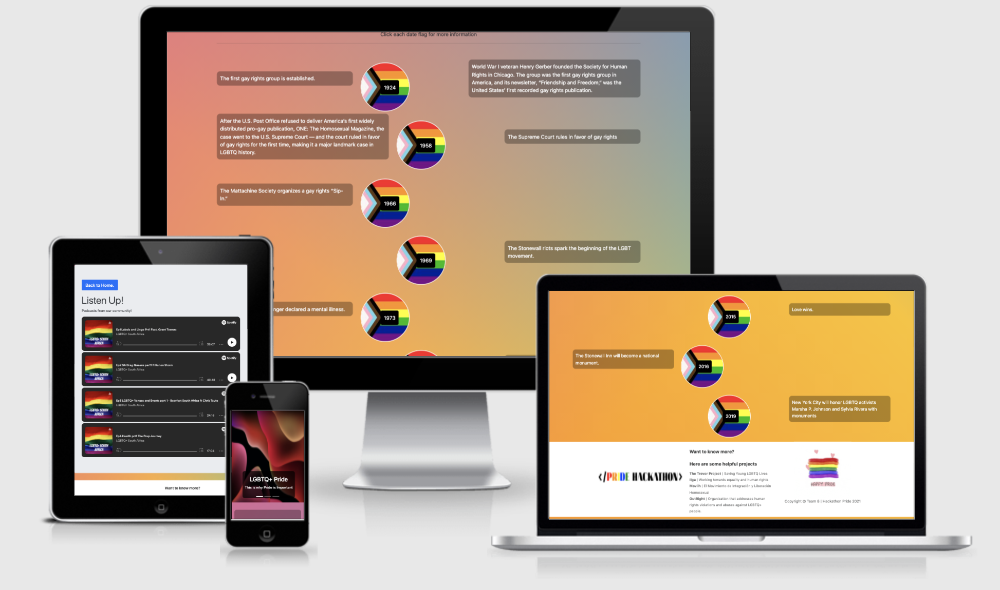
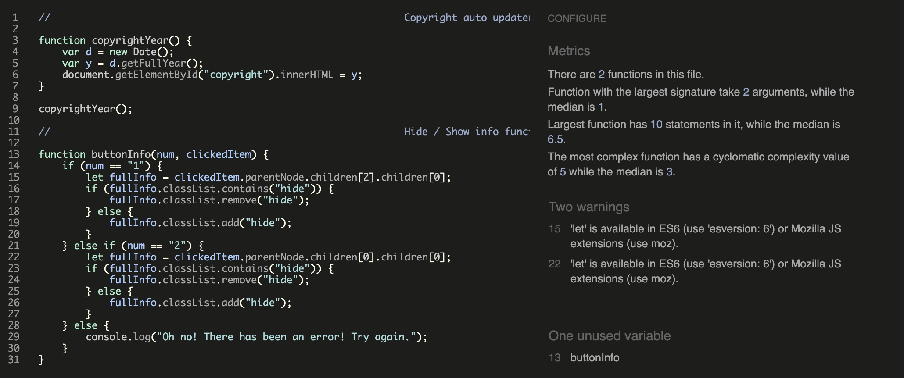
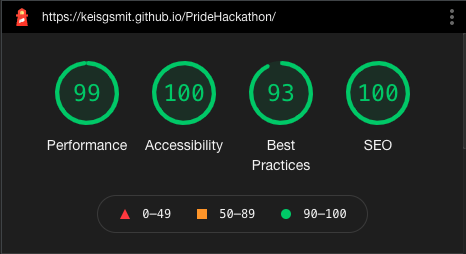
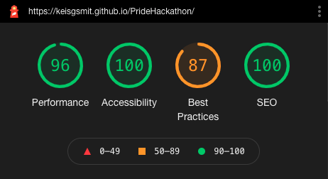

# LGBTQ+ History

[Here is a link to the final project](https://KeisGSmit.github.io/PrideHackathon)

This site is an information site about the history of the LGBTQ+ movement. 
It is designed to be responsive on a wide range of devices, whilst also being easy to navigate through. 
It was created for an LGBTQ+ themed proud-coders Hackathon with [Code Institute](https://codeinstitute.net/) in June 2021.

## Contents

* [User Experience (UX)](#user-experience-(ux))
    * [Initial Discussion](#initial-discussion)
    * [User Stories](#user-stories)

* [Design](#design)
    * [Color Scheme](#color-scheme)
    * [Typography](#typography)
    * [Imagery](#imagery)
    * [Wireframes](#wireframes)
    * [Features](#features)
    * [Audio](#audio)

* [Technologies Used](#technologies-used)
    * [Languages Used](#languages-used)
    * [Frameworks, Libraries & Programs Used](#frameworks-libraries-and-programs-used)

* [Deployment](#deployment)
    * [Initial Deployment](#initial-deployment)
    * [How to Fork it](#how-to-fork-it)
    * [How to Clone it](#how-to-clone-it)
    * [Making a Local Clone](#making-a-local-clone)

* [Testing](#testing)
    * [W3C Validator](#w3c-validator)
    * [Testing User Stories](#testing-user-stories)
    * [Full Testing](#full-testing)
    * [Further Testing](#further-testing)
    * [Solved Bugs](#solved-bugs)
    * [Known Bugs](#known-bugs)
    * [Lighthouse](#lighthouse)
        * [Performance](#performance)
        * [Accessibility](#accessibility)
        * [Best Practices](#best-practices)
        * [SEO](#seo)

* [Credits](#credits)
    * [Code](#code)
    * [Content](#content)
    * [Media](#media)
    * [Acknowledgements](#acknowledgements)

---
## User Experience (UX)
### Initial Discussion
For the proud-coders Hackathon, we were asked to contribute to finding solutions that amplify LGBTQ+ voices, connect the community, that educate others, that support the needs of LGBT+ people. The overall objective was to build something that promotes and celebrates the LGBTQ+ community. We spoke to friends of ours who are in the LGBTQ+ community, and there was an overall feeling that many of them didn't know the history of Pride.

### User Stories
#### Client Goals
* To learn more about the history of Pride, and the momentous steps that were taken up to the present day.

#### First Time Visitor Goals
* It should be easy to understand how to use the site.
* The information should be clear to read.

#### Returning Visitor Goals
* The site should look good, so a user would feel happy to show their friends.

---
## Design
### Color Scheme
* We used a rainbow color scheme to fit with the theme of Pride, using black and white for other areas so as to not overwhelm the user. We also used black with a low opacity to help the text pop from the background more.

### Typography
* We used the Arial, Helvetica, sans-serif font-family, as we knew it wouldn't cause any issues across browsers, as they're standard fonts.
* This font-family is also easy to read, and allows the text to be easily legible for all users.

### Imagery
* We only used the up to date Pride flag in the date circles, to link with the theme of the Hackathon, as well as supporting all of those in the LGBTQ+ movement.
* We used an animated gif of a pride flag sending out love hearts to show the love that comes with being a part of Pride.
* We used basic backgrounds in bright colors for the carousel, to link with the Pride rainbow.

### Wireframes
[Here is the wireframe for desktop for this project](src/docs/wireframes.pdf).

### Features
* There is a copyright function at the bottom that automatically updates to the current year.
* There is a hide / show function to show or hide the information for each date on click.
* There is also an embedded Spotify player on the Community page, with podcasts on relating to the LGBTQ+ Community.

### Audio
* No audio is used on this site.
---

## Technologies Used
### Languages Used
* [HTML5](https://developer.mozilla.org/en-US/docs/Web/Guide/HTML/HTML5)
* [CSS3](https://developer.mozilla.org/en-US/docs/Archive/CSS3#:~:text=CSS3%20is%20the%20latest%20evolution,flexible%20box%20or%20grid%20layouts.)
* [JavaScript](https://developer.mozilla.org/en-US/docs/Web/JavaScript)

### Frameworks Libraries and Programs Used
#### Bootstrap
[Bootstrap](https://getbootstrap.com/) was used to help us quickly design a good looking responsive site.
#### Git:
[Git](https://git-scm.com/) was used for version control by utilizing the Gitpod terminal to add and commit to Git and push to GitHub.
#### GitHub:
[GitHub](https://github.com/) is used to store the code for this project after being pushed from Git.
#### Balsamiq:
[Balsamiq](https://balsamiq.com/) was used to create the wireframes during the design process.
#### Responsinator:
[Responsinator](http://www.responsinator.com/) was used to help improve the responsive design on a variety of devices.
#### Google DevTools:
[Google DevTools](https://developer.chrome.com/docs/devtools/) was used to help us find what code correlated to which feature.
#### Am I Responsive Design:
[Am I Responsive Design](http://ami.responsivedesign.is/#) was used to check the responsive design of the site, and to create the final site image.
#### Shields.io:
[Shields.io](https://shields.io/) was used to create the GitHub badges for this README.md file.
#### Lighthouse:
[Lighthouse](https://developers.google.com/web/tools/lighthouse) was used to ensure that our code was as performant as possible, confirming to best practices, and SEO and Accessibility guidelines.

## Deployment
### Initial Deployment
This site was deployed to GitHub Pages by following these steps:
1. Login or Sign Up to [GitHub](www.github.com).
2. Create a new repository named "PrideHackathon".
3. Once created, click on "Settings" on the navigation bar under the repository title.
4. Scroll down to "GitHub Pages".
5. Under "Source", choose which branch to deploy. We chose "main", but this is sometimes shown as "master".
6. Choose which folder to deploy from, usually "/root".
7. Click "Save", then wait for it to be deployed. It can take some time for the page to be fully deployed.
8. Your URL will be displayed above "Source".

### How to Fork it
1. Login or Sign Up to [GitHub](www.github.com).
2. On GitHub, go to [KeisGSmit/PrideHackathon](https://KeisGSmit.github.io/PrideHackathon).
3. In the top right, click "Fork".

### How to Clone it
1. Login or Sign Up to [GitHub](www.github.com).
2. Fork the repository KeisGSmit/PrideHackathon using the steps above in [How to Fork it](#how-to-fork-it).
3. Above the file list, click "Code".
4. Choose if you want to clone using HTTPS, SSH, or GitHub CLI, then click the copy button to the right.
5. Open Git Bash.
6. Change the directory to where you want your clone to go.
7. Type git clone and then paste the URL you copied in step 4.
8. Press Enter to create your clone.

### Making a Local Clone
1. Log in to [GitHub](www.github.com) and locate the [Repository](https://KeisGSmit.github.io/PrideHackathon) for this site.
2. Under the repository name, above the list of files, click "Code".
3. Here you can either Clone or Download the repository.
4. You should clone the repository using HTTPS, clicking on the icon to copy the link.
5. Open Git Bash.
6. Change the current working directory to the new location, where you want the cloned directory to be.
6. Type git clone, and then paste the URL that was copied in Step 4.
7. Press Enter, and your local clone will be created.

For a more detailed version of these steps, go to the [Github Docs](https://docs.github.com/en/github/creating-cloning-and-archiving-repositories/cloning-a-repository#cloning-a-repository-to-github-desktop) page on this topic.

---
## Testing
### W3C Validator
The W3C Markup Validator, W3C CSS Validator and JSHint were used to validate the project to ensure there were no syntax errors within the site.

1. W3C Markup Validator
    * [HTML Results](https://validator.w3.org/nu/?doc=https%3A%2F%2Fkeisgsmit.github.io%2FPrideHackathon%2F)

2. W3C CSS Validator
    * [CSS Results](https://jigsaw.w3.org/css-validator/validator?uri=https%3A%2F%2Fkeisgsmit.github.io%2FPrideHackathon%2F&profile=css3svg&usermedium=all&warning=1&vextwarning=&lang=en)
    * There is one error showing up, which is "text is not a background-clip value : text". This is a common validation error, and when we did research into this, it was common knowledge that it should be ignored, because text is a valid background-clip value.

3. JSHint
    * [JSHint](https://jshint.com/)

### Testing User Stories
#### Client Goals
##### To learn more about the history of Pride, and the momentous steps that were taken up to the present day.
* Each main moment of the Pride movement in the USA has been included, with information about each event.

#### First Time Visitor Goals
##### It should be easy to understand how to use the site.
* Everything is easy to view on the main page.
* We have included a small instruction at the top, of how to view the information.

##### The information should be clear to read.
* All information is white text on a black transprent background, making the text clear to read.
* We have also used a standard font-family, so users won't be distracted by the font.

#### Returning Visitor Goals
##### The site should look good, so a user would feel happy to show their friends.
* The site has an attractive background rainbow, and a rainbow as the header.
* The layout is appealing, whilst also being simple so as to not over-clutter the screen.

#### Desktop / Laptop
1. Google Chrome
    * All tested and working correctly.

2. Microsoft Edge
    * All tested and working correctly.

3. Mozilla Firefox
    * All tested and working correctly.

4. Safari
    * All tested and working correctly.

#### Tablet
1. Safari
    * All tested and working correctly.

#### Mobile
1. Google Chrome
    * All tested and working correctly.

2. Safari
    * All tested and working correctly.

3. Samsung Internet
    * All tested and working correctly.

### Further Testing
The website was tested on Google Chrome, Firefox, Microsoft Edge, Safari and Samsung Internet browsers. We did not test on Internet Explorer, as it has now been depreciated in favour of Microsoft Edge.
The website was viewed on a variety of devices, including:
* Acer Aspire V Nitro Laptop, running Windows 10
* Lenovo B51 IntelCore i7 Laptop, running Ubuntu 16.04 LTS
* MacBook Pro (15-inch, 2017), running macOS Catalina
* MacBookAir7,2 (13-inch, 2017)
* iPad 6,11 5th generation, running iOS 10.3
* iPhone X
* iPhone 12
* OPPO Find X2
* OPPO Find X2 Lite
* Samsung Galaxy S9
* Samsung A20
* xBox One

A large amount of testing was done to ensure that all information was visible or hidden correctly, and all functions worked as they should.
Friends, family members, and other developers were asked to review the site and documentation to point out any bugs and/or user experience issues that they came across.

### Solved Bugs
1. The proper layout design wasn't showing for one of our developers.
    * We checked that he had the latest pull of the repo.
    * We used DevTools to check his code was being included properly.
    * We could see that width and height: fit-content weren't being accepted on his browser.
    * As he was using Firefox, we checked on [CanIUse](https://caniuse.com/?search=fit-content) to find out the correct prefixes to make this work on Firefox.
    * We then added in a -moz- prefix, which fixed this bug.

### Known Bugs
* No bugs have been knowingly left in this site.
* If you find any bugs, please contact one of the team on our GitHub links below.

### Lighthouse
We tested our website using Google DevTools [Lighthouse](https://developers.google.com/web/tools/lighthouse) feature, and got these results:

#### Desktop

#### Mobile

#### Performance:
* The only place we lost performance was very minor amounts of images not being properly sized, and video formats being required for animated content. These were both due to the gif we've used in our footer.
* Our images also do not have explicit width and height, as we opted for our images being more responsive.
* All other issues were due to us using Bootstrap, which we decided was a worthwhile trade-off due to the speed at which we were able to complete this project.
* These issues were magnified on mobile, as the images were not properly sized at all for mobile, as they were shrunk down from the desktop size.

#### Accessibility:
* We were incredibly careful to ensure that we had a fully accessible site.
* All images have alt attributes.
* All tap targets are above the required minimum of 48px.

#### Best Practices:
* This also suffered from our images - both incorrect aspect ratio, and low resolution. This is caused by our carousel images, which we were unable to edit.

#### SEO:
* We ensured we had full meta tags in our head element.
* We also have a valid rel="canonical" tag in our head to tell search engines the source of truth for our site.
* All external links being set with target="_blank" and rel="noopener" to avoid any security risks.

---
## Credits
### Code
* No code was taken from any other developer.

### Content
* All code was written and edited by team 8 from [Code Institute](https://codeinstitute.net/):
    * [Abi Harrison](https://github.com/Abibubble)
    * [Erik Englund](https://github.com/EnglundE)
    * [Keis Smit](https://github.com/KeisGSmit)
    * [Luana Andrade](https://github.com/luziandrade)
    * [Manni Silva](https://github.com/manni8436)
* Code from Bootstrap was also used to create a fully responsive site in a short space of time.

### Media
* [The Pride flag](https://www.them.us/story/ipride-flag-redesign-black-brown-trans-pride-stripes) was found on this site.
* The carousel images were found [here](https://images.unsplash.com/photo-1550684848-fac1c5b4e853?ixlib=rb-1.2.1&ixid=MnwxMjA3fDB8MHxwaG90by1wYWdlfHx8fGVufDB8fHx8&auto=format&fit=crop&w=1050&q=80), [here](https://images.unsplash.com/photo-1620121692029-d088224ddc74?ixid=MnwxMjA3fDB8MHxwaG90by1wYWdlfHx8fGVufDB8fHx8&ixlib=rb-1.2.1&auto=format&fit=crop&w=1189&q=80), and [here](https://images.unsplash.com/photo-1620120966883-d977b57a96ec?ixlib=rb-1.2.1&ixid=MnwxMjA3fDB8MHxwaG90by1wYWdlfHx8fGVufDB8fHx8&auto=format&fit=crop&w=1189&q=80).
* [The Pride flag gif](https://giphy.com/gifs/gay-rainbow-pride-Ga1UmWZ9jdYOc) was found on Giphy by [Evahill](https://giphy.com/evahill).

### Acknowledgements
* Our mentor, [Maria](https://github.com/maria-ci), at [Code Institute](https://codeinstitute.net/), for continuous helpful feedback and support.
* The team at [Code Institute](https://codeinstitute.net/), for teaching us the necessary skills to create this site.